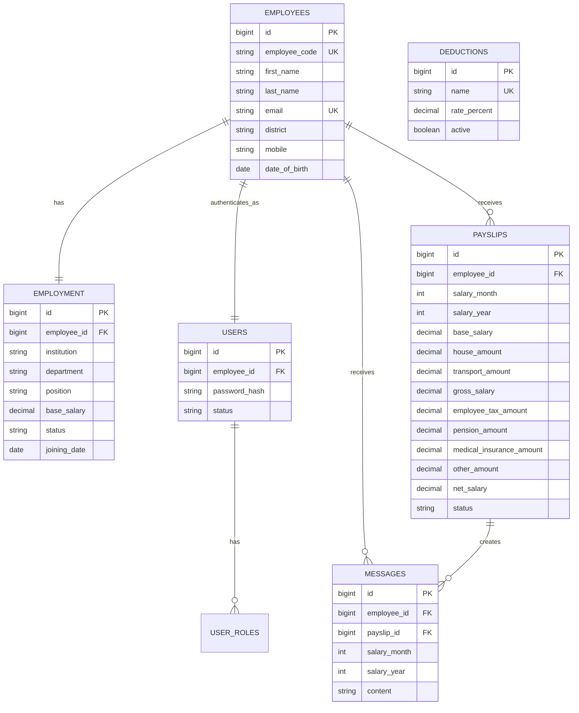
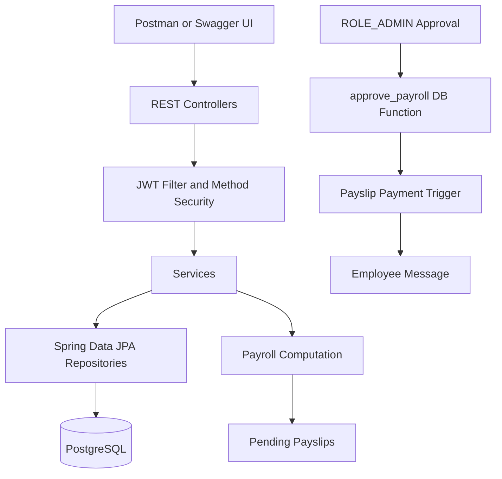

# Enterprise Resource Planning Backend

Spring Boot backend for the SPE integrated assessment: Employee Management, User Management with JWT, deductions, payroll processing, payslip viewing/download, and database-side payment messaging.

## ERD



## Spring Boot Flow



## Default Data

The app seeds the required deductions:

| Name | Percentage |
| --- | ---: |
| EmployeeTax | 30 |
| Pension | 6 |
| MedicalInsurance | 5 |
| Others | 5 |
| House | 14 |
| Transport | 14 |

Demo users are seeded when `app.seed-demo-data=true`:

| Role | Email | Password |
| --- | --- | --- |
| ROLE_ADMIN | admin@rca.gov.rw | Admin@123 |
| ROLE_MANAGER | manager@rca.gov.rw | Manager@123 |
| ROLE_EMPLOYEE | peter@rca.gov.rw | Employee@123 |

## Main Endpoints

- `POST /api/auth/login`
- `POST /api/register`
- `POST /api/register/verify-email`
- `POST /api/register/resend-otp`
- `POST /api/employees` for `ROLE_MANAGER`
- `GET /api/employees` for `ROLE_MANAGER` or `ROLE_ADMIN`
- `GET|POST|PUT|DELETE /api/deductions` for `ROLE_MANAGER` or `ROLE_ADMIN`
- `POST /api/payroll/process` for `ROLE_MANAGER`
- `POST /api/payroll/approve` for `ROLE_ADMIN`; this marks payslips as paid, creates database messages, and emails employees their approved payslips.
- `GET /api/me`, `/api/me/payslips`, `/api/me/payslips/pending`, `/api/me/messages`

Swagger UI is available at `/swagger-ui.html`.

## Registration And OTP Verification

New users can register publicly, but the account is created with `PENDING_VERIFICATION` status. The user must verify the email OTP before login works.

Register:

```json
{
  "employeeCode": "EMP900",
  "firstName": "Alice",
  "lastName": "Uwase",
  "email": "alice@example.com",
  "district": "Gasabo",
  "mobile": "+250780000001",
  "dateOfBirth": "1998-04-12",
  "institution": "RCA",
  "department": "ICT",
  "position": "Software Developer",
  "baseSalary": 70000,
  "joiningDate": "2025-01-01",
  "password": "Employee@123"
}
```

Verify OTP:

```json
{
  "email": "alice@example.com",
  "otp": "123456"
}
```

Resend OTP:

```json
{
  "email": "alice@example.com"
}
```

Configure SMTP before testing real emails:

```properties
spring.mail.username=your-email@gmail.com
spring.mail.password=your-app-password
app.mail.from=your-email@gmail.com
```

## Payment Approval Emails

When an admin approves payroll through Swagger, the system automatically sends each paid employee an email with gross salary, deductions, and net salary.

1. Configure SMTP in `application.properties`.
2. Login as admin with `POST /api/auth/login`.
3. Click **Authorize** in Swagger and paste the admin JWT.
4. Run:

```http
POST /api/payroll/approve
```

```json
{
  "month": 7,
  "year": 2025
}
```

Each employee included in that approved payroll receives an email at the email address stored on the employee record. If SMTP is not configured correctly, payroll approval still succeeds and the failed email attempt is logged.

## Payroll Formula

- `House = baseSalary * HouseRate / 100`
- `Transport = baseSalary * TransportRate / 100`
- `Gross = baseSalary + House + Transport`
- `Total Deductions = EmployeeTax + Pension + MedicalInsurance + Others`
- `Net Salary = Gross - Total Deductions`

Duplicate payroll for the same employee/month/year is blocked by both service validation and the database unique constraint.

## Database Routine

On PostgreSQL startup, the app installs `src/main/resources/db/postgresql-payroll-routines.sql`.

- `approve_payroll(month, year)` updates pending payslips to `PAID`.
- `trg_payslip_payment_message` creates a row in `messages` when a payslip becomes `PAID`.

Message format:

```text
Dear <FIRSTNAME> Your salary of <MONTH/YEAR> from <INSTITUTION> <AMOUNT> has been credited to your <EMPLOYEE ID> account Successfully.
```
